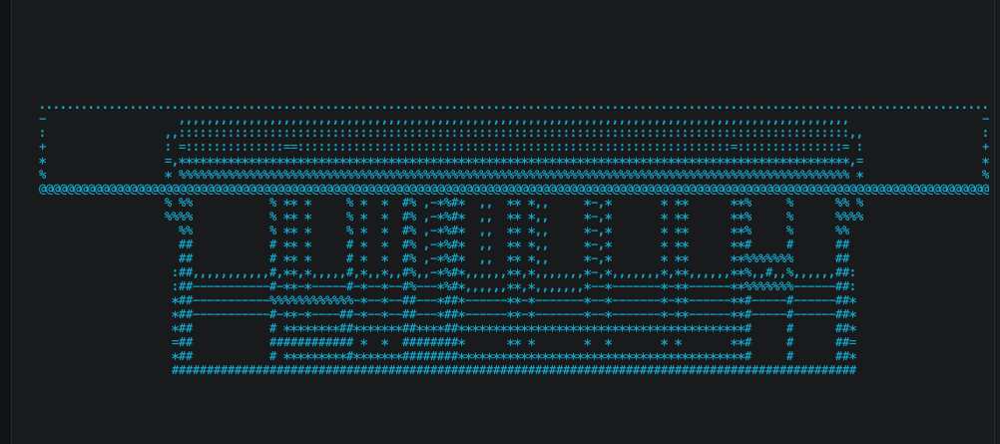

# Cli Model

Interactive terminal experiment for opening local iModels and projecting them into an ANSI terminal view.



## Goal

`cli-model` treats the terminal like a deliberately low-fidelity viewport:

1. Open a local iModel file in read-only mode.
2. Extract a drawable slice of its geometric content.
3. Project that content into a coarse terminal view that is useful for exploration, not replacement-level viewing.

The current first slice is backend-first and favors a thin dependency stack over a heavyweight TUI framework.

## Commands

```sh
npm run build
npm run cli -- ./path/to/model.bim
npm run cli -- ./path/to/model.bim --hidden-lines
npm run typecheck
```

## Controls

- `q` / `Esc`: quit
- Arrow keys or `h`,`j`,`k`,`l`: pan
- `w`,`a`,`s`,`d`: rotate pitch/yaw
- `+` / `-`: zoom
- `p`: cycle preset views (`top`, `front`, `side`, `iso`)
- `m`: cycle render mode
- `o`: toggle mesh hidden-line occlusion
- `[` / `]`: switch models
- `r`: reset view
- `i`: toggle HUD
- `?`: toggle help

## Notes

- The current projection pass uses a rotated orthographic camera, prefers exported linework, and falls back to filtered mesh-derived wireframe edges plus placement bounding boxes when needed.
- Hidden-line occlusion is optional and currently applies only to mesh-derived linework, not native exported lines.
- The viewer currently focuses on local files that backend APIs can open directly from disk.
- This is an experiment in representation. Expect coarse spatial readability, not viewer-grade fidelity.

- Keep dependencies minimal and local to this project.
